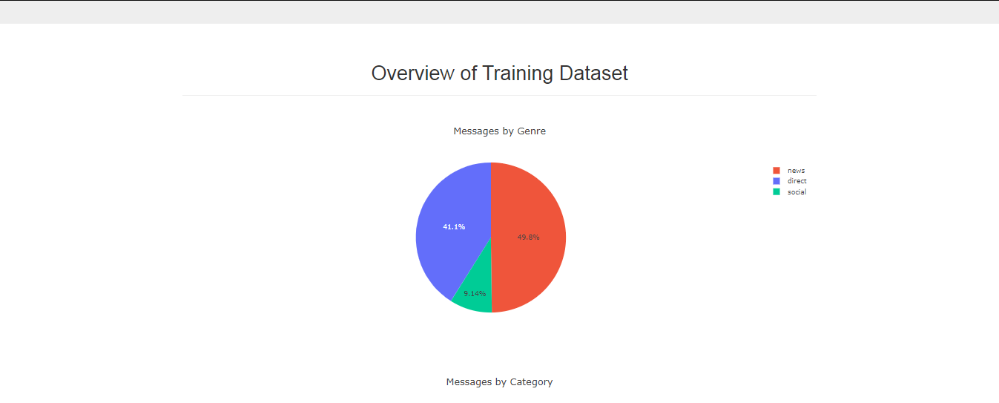
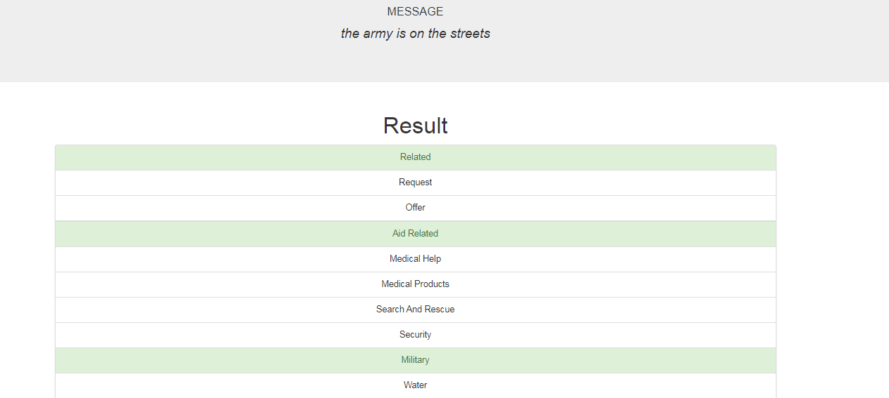

# Disaster Response Pipeline Project

A Machine Learning Pipeline to categorize messages sent during disaster events, so that they can be forwared to the appropriate disaster relief agency.

It includes a web app for data visualization, where an emergency worker can input a new message and get classification results in several categories.

The data set, provided by Figure Eight, contains real messages that were sent during disasters. 

## Project Components:

The projects consists of three main components:

### ETL Pipeline: process_data.py

Data Preprocessing using an ETL Pipeline.

- Loads the messages and categories datasets
- Merges the two datasets
- Cleans the data
- Stores it in a SQLite database

Arguments:
- messages_filepath:   path to the csv file containing messages (e.g. disaster_messages.csv)
- categories_filepath: path to the csv file containing categories (e.g. disaster_categories.csv)
- database_filename:   path to SQLite destination database (e.g. disaster_response_db.db)

### ML Pipeline: train_classifier.py

Trains a multi-label classifier for text messages using a ML Pipeline

- Loads data from the SQLite database
- Splits the dataset into training and test sets
- Builds a text processing and machine learning pipeline
- Trains and tunes a model using GridSearchCV
- Outputs results on the test set
- Exports the final model as a pickle file

Arguments:
- database_filepath:    path to SQLite destination database (e.g. disaster_response_db.db)
- model_filepath:       path to pickle file name where ML model needs to be saved (e.g. classifier.pkl)

### Flask Web App

Search Bar:

Overview of training dataset:

Example of a message classification:

## Instructions:
1. Run the following commands in the project's root directory to set up your database and model.

    - To run ETL pipeline that cleans data and stores in database
        `python data/process_data.py data/disaster_messages.csv data/disaster_categories.csv data/DisasterResponse.db`
    - To run ML pipeline that trains classifier and saves
        `python models/train_classifier.py data/DisasterResponse.db models/classifier.pkl`

2. Run the following command in the app's directory to run your web app.
    `python run.py`

3. Go to http://0.0.0.0:3001/
